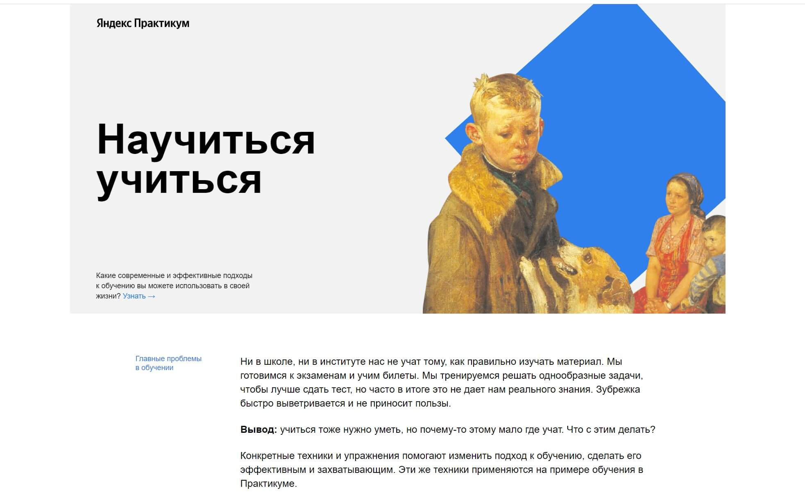

# Проект "Научиться учиться".

### Проект представляет собой отработку теории и закрепление навыков, полученных в процессе прохождения курса обучения веб-разработке Яндекс Практикума. В проекте используются:

- HTML5 и CSS3;
- семантические теги;
- Flex-box;
- CSS-анимация;
- БЭМ;

---

### [[Проект опубликован на github-pages.](https://h1ze.github.io/how-to-learn/
